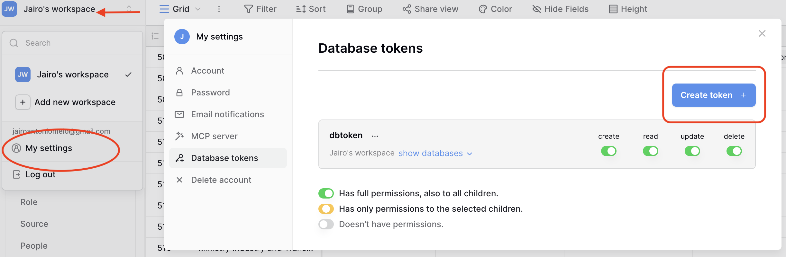
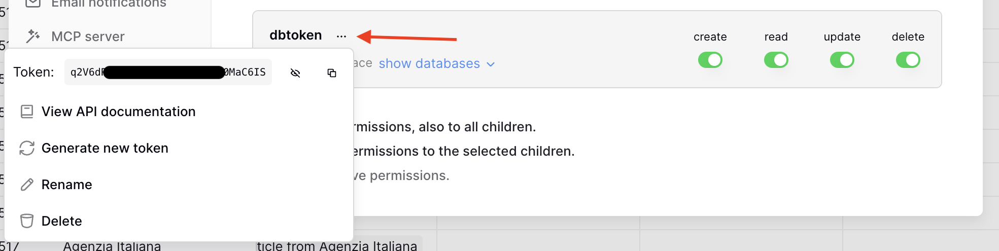

## How to use it

## Prerequisites

To input the data into Baserow, you need an API token. Generate one in Baserow under `My settings` -> `Database tokens`



You can retrieve the token just by clicking the three dots next to the token name and copying it.



## Prepare the environment

### Open the Terminal

**On Mac:** Press `Cmd + Space`, type "Terminal", and press Enter.

**On Windows:** Press `Win + R`, type "cmd", and press Enter.

Use the terminal to navigate to the folder where you want to clone the repository and run the following commands:

### Clone the repository

Clone this repository to your local machine using:

```bash
git clone git@github.com:jairomelo/nocodb2baserow.git
cd nocodb2baserow
```

**If you don't have SSH set up**, you can use the HTTPS link instead:

```bash
git clone https://github.com/jairomelo/nocodb2baserow.git
cd nocodb2baserow
```

### Create a virtual environment

Create and activate a virtual environment to manage dependencies:

```bash
python3 -m venv .venv
source .venv/bin/activate  # On Windows use `.venv\Scripts\activate`
```

### Install dependencies
Install the required Python packages using pip:

```bash
pip install -r requirements.txt
```

### Set up environment variables

1. **Rename the file**: Change `.env-dev` to `.env` (just remove the `-dev` part)

2. **Fill in your information**: Open the `.env` file and add your values:

```
API_TOKEN=<paste_your_api_token_here>
BASEROW_BASE_URL=<your_baserow_url>
DATABASE_ID=<your_database_number>
USER_EMAIL=<your_email>
USER_PASSWORD=<your_password>
```

**How to find each value:**

- **API_TOKEN**: Copy it from Baserow (see screenshots above)
- **BASEROW_BASE_URL**: The web address of your Baserow instance (e.g., `http://localhost/` or `https://baserow.yourdomain.com/`)
- **DATABASE_ID**: The number in your browser's address bar when viewing the database. 
  - Example: If the URL is `http://localhost/database/184/table/456`, the DATABASE_ID is **184**
- **USER_EMAIL**: Your Baserow login email
- **USER_PASSWORD**: Your Baserow login password

## Run the migration

Migration consist of two steps: Create the table structure in Baserow and then migrate the data.

### Step 1: Create Baserow table structure

Run the following command to create the table structure in Baserow. This step only needs to be done once.

```bash
python3 components/create_tables.py
```

### Step 2: Migrate data to Baserow

Run the following command to migrate the data to Baserow:

```bash
python3 putData.py --clear
```

This command will perform a full migration, clearing any existing data in the target tables before importing the new data.

You can also migrate a single table by specifying the table name:

```bash
python3 putData.py --table Entity
```

For a dry run that previews the changes without making any modifications, use:

```bash
python3 putData.py --dry-run
```

## Troubleshooting

If you encounter any issues during the migration:

1. **Check the terminal output** for error messages
2. **Verify your `.env` file** - Make sure all values are filled in correctly
3. **Ensure Baserow is running** and you can access it in your browser
4. **Open an issue on GitHub** if the problem persists: [github.com/jairomelo/nocodb2baserow/issues](https://github.com/jairomelo/nocodb2baserow/issues)

## Notes
- The migration may take several minutes depending on the amount of data
- Make sure you have the necessary permissions in Baserow to create tables and import data
- The `--clear` option will delete existing data in the tables before importing

